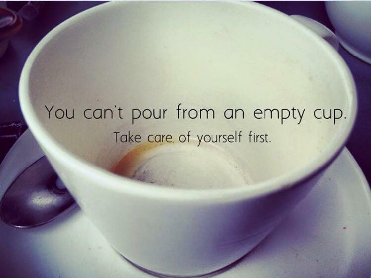

#Moving Towards Mental Health
<html>
<head>
  <title> Moving Towards Mental Health</title>
  <link rel = "stylesheet" href = "MentalHealthWebsite.css">
</head>
<body>
  <ul class = "menu">
    <li><a href = "MentalHealthWebsite.html"; style = "font-size: 25px"> Home &nbsp </a></li>
    <li><a href = "aboutus.html"; style = "font-size: 25px"> About Us &nbsp &nbsp</a></li>
    <li><a href = "Happiness.html"; style = "font-size: 25px"> Happiness &nbsp</a></li>
    <li><a href = "Relaxation.html"; style = "font-size: 25px">Relaxation  &nbsp</a></li>
    <li><a href = "Confidence.html"; style = "font-size: 25px"> Confidence  &nbsp</a></li>
    <li><a href = "mondaymotivation.html"; style = "font-size: 25px"> Monday Mental Motivation  &nbsp</a></li>
  </ul>

<h1 id="WebsiteHeader">Moving Towards Mental Health</h1>

<h2 class = "one">What is Mental Health?</h2>
<ul style = "font-size: 20px">
  <li>Mental health is all about our psychological, emotional, and social well-being. </li>
  <li>Especially during the COVID-19 pandemic, many people are facing a lot of stress and anxiety. </li>
  <li>This can negatively impact your physical health, mental health, and how happy you are. </li>
</ul>
 
<h2 class = "one "> How do we boost our mental health?</h2>

  You can’t always control the circumstances.
  But, you <b>CAN</b> control how you choose to react to the situation.

  The Key to Mental Health is engaging in activities that make you feel <ins> Happy, Relaxed, and Confident</ins>.

 <b>
  These three things will allow you to build your emotional resilience and ultimately, improve your mental health.
</b>

</body>
</html>
